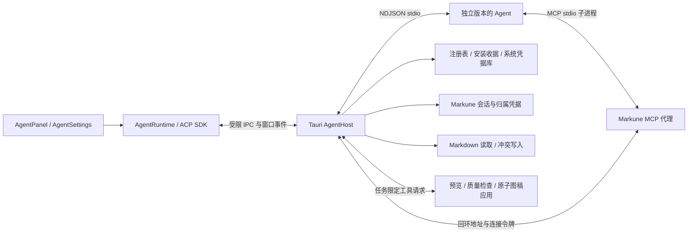

# ACP Agent Host

Markune 使用 ACP v1 连接独立安装的本地智能体。应用负责交互界面、安装与版本、进程、会话索引、编辑器协调及 Markune 工具；智能体负责推理、供应商认证、模型配置、执行策略及其自身会话。模型调用不经过 Markune 的云端代理。

用户已确认完整迁移，并选择“新系统从新会话开始，旧历史留在原 Codex 中”。旧 App Server 默认启动、IPC 注册、固定 `@openai/codex` 依赖和两个 Codex sidecar 分发入口已退出产品路径。旧 Rust 协议模块仅在历史回归测试中编译；旧前端协议组件不再由产品面板加载。Markdown、绘图编译器、预览质量检查、原子应用和资产查看器继续复用。旧文件保留不代表提供双运行时开关。

## 为什么这样迁移

原实现会从共享 Codex Home 查询工作区最近的线程并自动恢复，这不能证明线程属于当前 Markune 连接；与其他客户端同时恢复时可能触发 active writer 冲突。新系统不执行供应商全局会话列表或猜测最近会话。协议迁移和独占会话归属一起解决客户端可控的重复占用；供应商自身的进程锁错误仍作为明确错误呈现。

JetBrains 把智能体注册表、独立安装、认证、聊天和模型/模式选择分开处理。Markune 采用同一职责划分，但保留自己的 Markdown 与绘图安全边界。[JetBrains ACP](https://www.jetbrains.com/help/ai-assistant/acp.html)、[智能体激活](https://www.jetbrains.com/help/ai-assistant/activate-agents.html)

ACP 是编辑器与智能体之间的协议，不等于模型接口、MCP 或操作系统沙箱。智能体仍可能直接访问用户系统；不能把 Markune 的 `fs/*` 根目录校验描述为对智能体所有工具的强制隔离。[ACP 架构](https://agentclientprotocol.com/get-started/architecture)

Codex ACP 2.1.1 自身仍通过 Codex App Server 工作，当前依赖 `@openai/codex ^0.159.1`。迁移消除的是 Markune 对私有 App Server 消息和固定捆绑版本的直接耦合，不是声称上游内部不再使用 App Server。[Codex ACP 源码](https://github.com/agentclientprotocol/codex-acp)

## 模块与数据流

- `agent-api.ts`：产品级 Tauri 命令与目录类型。
- `agent-runtime.ts`：官方 `@agentclientprotocol/sdk 1.7.0` fluent client、Web Streams、连接状态、能力、交互、取消和会话投影。未知扩展由 SDK 返回方法错误。
- `agent-session.ts`：流式内容、工具增量与计划的确定性投影。
- `agent-panel.tsx`、`agent-interaction.tsx`、`agent-login.tsx`：聊天、动态配置、权限与询问、原生登录终端。
- `src-tauri/src/agents/catalog.rs`：固定版本安装、本机发现、来源与校验、安装握手。
- `process.rs`：子进程组、IPC 所属窗口、双向 JSON-RPC、独占会话租约与归属凭据。
- `context.rs`：每轮文档/图稿引用的权威解析、绘图参数及目标约束。
- `client_tools.rs`：受限文本文件与会话终端实现。
- `mcp.rs`：Markune 文档/绘图 MCP、一次性工具回传、令牌绑定的回环桥。

使用稳定 ACP v1；v2 仍为 Draft，不作为默认协议。SDK 避免手写协议路由，但安装、背压、系统进程、会话归属和编辑器冲突由 Markune 实现。[v1 初始化](https://agentclientprotocol.com/protocol/v1/initialization)、[TypeScript SDK](https://agentclientprotocol.com/libraries/typescript)、[v2 Draft](https://agentclientprotocol.com/announcements/acp-v2-draft)

## 安装、更新和回退

初始目录是 2026-10-07 核实的官方 Registry 快照，只展示此次要求的 11 个智能体；刷新读取官方 CDN，完整快照散列绑定用户选择的安装动作，目录改变后要求重新选择。目录版本不是供应商所有发布渠道的最新版本，也不是认证标志。[Registry](https://github.com/agentclientprotocol/registry)

npm 包身份按 Agent ID 固定映射，版本必须精确；通过独立安装目录及空的应用专属 npm 配置执行 npm，避免用户级 scoped registry 重定向官方包，保存依赖锁散列。需要 Node 时优先兼容的本机 Node 24/26，否则下载官方 Node 24 并核对 SHASUMS256。npm 入口可能在 postinstall 后变成原生二进制，宿主根据文件格式选择直接执行或 Node，不假设所有 npm bin 都是 JavaScript。原生包限制 HTTPS 来源及重定向、大小、路径和解压总量，拒绝越界路径，跳过归档链接。有发布者 SHA-256 时必须核对；没有时收据只记录下载散列，不能把自算散列称为发布者完整性保证。

安装在临时目录完成后发布为不可变版本目录，并使用隔离 HOME 完成 `initialize` 检查。验证不认证、不创建会话、不发送提示词；验证目录会预先建立 Codex 要求的 CODEX_HOME，失败移除新目录，旧版本保持可用。成功才保存可选的 Profile。安装界面显示阶段并提供取消入口，关闭所属窗口会结束安装子进程。npm 安装有 15 分钟上限；网络读取受 HTTP 超时约束，取消在当前读取返回后阻止下一阶段。更新安装另一版本，不替换正在运行的可执行文件。旧版本继续显示在目录中，可为新会话选择；原会话绑定原 Profile，不跨供应商或版本自动搬迁状态。

用户可复用已安装 CLI，或通过原生程序选择器配置自定义 ACP 程序、参数与非敏感环境变量。凭据按 Profile 存系统 keyring，仅在原生启动时注入；不写 `profiles.json`、会话或日志。移除安装版本前须断开它的连接；移除保留会话记录，并且不删除用户自行安装的 CLI。

## 生命周期与历史

每个连接绑定窗口、Profile、canonical 工作区和一个运行版本；最多 8 个连接。stdout 只接受逐行 JSON-RPC，单帧 8 MiB，待处理请求 128 个，写队列 32 项。stderr 被消费但不原样转发，防止泄露凭据、文档内容或本地路径。进程退出、断开或窗口销毁清理对应进程组与会话终端。

`initialize`、`session/new|load`、认证均有硬超时；取消先发 `session/cancel`，清除待答交互和 MCP 任务授权，10 秒无结束则终止连接及子进程。不自动重发提示词，因为断连前操作可能已完成。[取消](https://agentclientprotocol.com/protocol/v1/cancellation)

原生接收成功的 `session/new` 响应后生成独立归属凭据，键包含 Profile、工作区和供应商 Session ID。只有匹配凭据的 Markune 历史可被恢复；运行中的会话租约阻止另一个连接恢复同一 Session。历史记录保存在应用本地数据目录 `agents/sessions`，与原 Codex Home 分离；全局及工作区最近任务不会被自动接管。

历史拥有本地会话 ID、供应商 Session ID、Agent/Profile/版本、工作区、时间和内容投影。支持 `loadSession` 时调用 `session/load` 并去重回放；不支持时可查看历史并新建会话。Profile 移除或停用时仍可只读查看历史。流式输出按 1 秒节流持续保存，正常完成/断开立即保存；列表读取工作区轻量摘要索引，避免加载每条完整消息。记录按会话串行原子写入，迟到的旧快照不能覆盖较新的记录，文件 Unix 权限为 0600、Agent 数据目录为 0700。不会读取旧 Codex JSONL、SQLite、session_index 或改写旧账号配置。

## 能力驱动的界面

模型、模式、推理相关项来自 `session/new|load` 的 `configOptions` 及后续更新，支持 select 分组和 boolean。旧 `modes` 仅作模式兼容；不把 Ask/Plan/Agent 或某组模型硬编码为所有供应商共有能力。配置值和协议 ID 原样传递，界面显示 Agent 给出的名称。[会话配置](https://agentclientprotocol.com/protocol/v1/session-config-options)

标准权限请求展示原工具详情及原候选项，只允许回传供应商已给出的 optionId，不根据时间自动同意。表单支持字符串、数值、布尔、单选和多选；未知字段类型不能提交。URL 询问通过用户点击打开，完成与拒绝分别响应。终端认证根据初始化返回的描述启动独立 PTY，把附加参数追加到基础命令，认证环境覆盖基础值；不向 `authenticate` 发送 terminal 类型。[认证](https://agentclientprotocol.com/protocol/v1/authentication)、[Elicitation](https://agentclientprotocol.com/protocol/v1/elicitation)

Cursor 的 `cursor/ask_question` 与 `cursor/create_plan` 是阻塞请求，分别以选项答案、计划批准/拒绝响应。todos、task 和 generate_image 通知作为进度显示。它们是明确的供应商扩展，不冒充 ACP 通用功能。[Cursor ACP](https://cursor.com/docs/cli/acp)

### 智能体界面布局

会话历史直接切换 AI 面板为列表模式，顶部固定“返回聊天”、刷新和标题/智能体搜索，列表独立滚动。每行显示对应智能体图标、标题和更新时间，长标题省略并保留完整提示。浏览历史仅隐藏聊天区域、不卸载聊天组件，保留草稿、附件、审批和任务连接；打开当前会话不会断开连接，运行中的任务禁止切换至其他会话。读取成功后才切换，按原 Profile 恢复 ACP 连接；移除/停用的 Profile 保持只读查看。返回聊天或切换选择后忽略迟到的历史读取结果。

底部由 `agent-config-toolbar.tsx` 渲染固定 28px 高的单行工具栏。常用选择项只显示当前值，hover/键盘聚焦时展示完整名称、值和供应商说明，弹出菜单仍保留分组和配置名称。按容器宽度为模型、模式、推理强度、协作模式分配有界宽度，放不下的项收进“更多会话设置”；该面板始终提供全部配置（包括未知扩展和旧版 modes）与上下文用量，不按字段数量删除能力。连接状态显示为带文字提示的小圆点。UI 对选择值作可逆编码以兼容空字符串默认 ID，发送 ACP 时仍保留原值。

Codex `fast-mode` 在供应商返回布尔配置或完整的 on/off 选择项时显示为闪电开关；点亮、填充与 `aria-pressed` 同步表明开启。变更期间禁止重复请求，收到供应商返回的配置后才更新状态；没有该能力或未知取值时不猜测，使用通用配置入口。供应商给出的速度/用量说明保留在提示与完整面板中。[Codex Fast Mode 定义](https://github.com/agentclientprotocol/codex-acp/blob/main/src/FastModeConfig.ts)

“当前”上下文只对应可见内容：系统页面不传递后台文档标签缓存；活跃图稿与当前文档互斥。此规则同时作用于欢迎文案、标签、发送前 flush 和任务上下文，不能仅隐藏旧标签。显式 @ 文档引用仍作为 mention 保留。

安装阶段、取消入口及操作错误显示在对应 Agent 卡片内；刷新目录只在刷新按钮上显示忙碌状态。管理弹窗固定标题、搜索与操作栏，仅 Agent 列表滚动。无消息时，欢迎区在聊天可用区域垂直居中；slash 命令在输入框上方浮出，方向键选择、Enter/Tab 填入、Escape 关闭，选择命令不会自动发送。

`agent-icon.tsx` 复用已安装的 `@thesvg/react 3.2.8` 并按图标模块导入。映射为 claude、trae、codex、cursor、github-copilot、zhipu、grok、kimi、minimax、opencode、bailian；CodeBuddy 和 Qoder 分别按用户指定使用 trae 与 bailian。图标覆盖目录、选择器与欢迎区。Codex/Cursor/Copilot/Grok 使用明暗变体，TRAE 在浅色使用单色、智谱在深色使用单色，Kimi 固定徽标底色以避免深色前景填充淹没字形。[theSVG 官方 React 接入](https://github.com/glincker/thesvg/tree/main/packages/react)

### 思考流与工具活动

2026-10-07 针对会话过程展示的资料核对与设计决策：

| 参考 | 核实内容 | Markune 的采用方式 |
|---|---|---|
| [JetBrains AI Chat](https://www.jetbrains.com/help/ai-assistant/ai-chat.html)、[ACP 接入](https://www.jetbrains.com/help/ai-assistant/acp.html) | Agent 报告执行进展；接入由独立 ACP 智能体提供 | 保持现有 ACP 能力和权限路径，不把供应商私有能力改造成虚假的通用功能 |
| [Cursor Agent](https://cursor.com/docs/agent/overview) | 区分文件搜索、Web、读取、编辑、终端、浏览器等工具任务 | 工具按操作语义使用图标，摘要与详情分层呈现 |
| [ChatGPT deep research](https://help.openai.com/en/articles/10500283-deep-research-in-chatgpt) | 运行中可查看进展，结果提供可核对来源 | 持续展示正在进行的活动，保留可展开的实际结果；不假设 ACP 具有完整的 research 控制或来源结构 |
| 用户提供的 `deepseek-harness-master` | `packages/client/ui-chat/src/client/chat/ReasoningRow.tsx` 使用次级文字、流式预览、独立展开状态；`ui-tool` 的 `web-row.tsx`、`GenericToolCard.tsx` 按工具类型渲染可展开详情 | 借鉴分层与状态反馈原则；根据本次明确要求改为思考流默认展开、结束默认收起。未复制其组件或依赖 |

以上是官方文档与本地源码研究，不是对 JetBrains、ChatGPT、Cursor 登录后界面的实机动效测量。没有足够证据断言它们的精确动画时长或全部折叠策略。Markune 的具体视觉与动效通过自己的真实组件合成预览验证。

- `agent-message.tsx` 独立渲染思考、工具、计划和正文。只显示 Agent 已经发送的 `agent_thought_chunk`；不请求或补造供应商未提供的推理。ACP 没有独立的思考结束事件，当前流尾为思考且会话运行中时默认展开，出现后续内容或该轮停止后默认收起。用户显式展开/收起优先，历史初始折叠，不伪造耗时。
- 工具优先使用 ACP `kind`（read/edit/delete/move/search/execute/think/fetch/switch_mode/other）决定图标。明确的工具名、`Web search:` 前缀、读取 `SKILL.md` 路径可细化展示；MCP/plugin 名称前缀仅作展示提示，未知工具保留通用图标。`_meta` 和输出正文不用于猜测身份或授权。[ACP 工具规范](https://agentclientprotocol.com/protocol/v1/tool-calls)
- 活动行保留原始标题，长标题省略并可展开；等待、执行、完成、失败使用中文文字和图标共同表达。仅当前运行轮次的 in_progress 转动，结束后未收到完成状态显示“未完成”，不把它改写为成功。失败默认展开，用户手动选择仍优先。
- 输入、输出、文件位置、文本、图片、diff、资源和终端 ID 在详情中保留；diff 使用字面文本呈现，避免把代码当成界面指令。原始输出即使为 false/0 也不丢失。终端仅收到 ID 时不伪造实时输出；没有结构化搜索结果时不从任意文本制造来源卡片。
- 增量合并忽略 null/undefined，保留先前字段；空数组仍明确替换集合。与 SDK 1.7.0 的 schema 语义一致，特别防止 name/title/rawInput 在状态更新时消失。
- 折叠使用 160ms 的高度/透明度过渡，流式文字按实际数据更新，不增加人工逐字延迟。`prefers-reduced-motion` 关闭过渡与旋转。折叠区域同时设置 aria-hidden/inert，初始折叠详情延迟渲染；思考区域有高度上限，用户滚动阅读时停止内部跟随。聊天底部跟随响应布局变化，用户点击详情时停止强制跟随。

## 文档与图稿

每次发送先经过现有编辑器/图稿 flush，失败停止发送。文档和图稿引用最多各 32 项，Rust 重读真实元数据并生成固定应用策略及 untrusted 数据；模型不能给自己新增当前图稿授权。界面文档名、路径及图稿内容不是指令。任务完成、取消或连接退出后清空授权。

`fs/read_text_file` 和 `fs/write_text_file` 限当前工作区，拒绝隐藏私有路径、父目录和符号链接；文本最多 4 MiB。读取登记内容散列，修改已有文件必须先读；写入复用文档锁定与原子冲突保护，外部内容改变时拒绝覆盖。写入前再次 flush 编辑器。终端按会话管理，有限输出缓冲，释放/停止清理进程组；这不限制外部 Agent 自己的直接文件/命令工具。[ACP 文件系统](https://agentclientprotocol.com/protocol/v1/file-system)、[终端](https://agentclientprotocol.com/protocol/v1/terminals)

Markune 作为独立 MCP 提供目录、文档读取/写入、图稿检查、Mermaid/思维导图预览、应用和创建。协议代理通过当前 Markune 可执行文件的 `--agent-mcp-stdio` 模式运行。父进程只绑定随机回环端口，令牌绑定当前连接；代理环境持有令牌，不把它加入命令行。未经当前任务授权的调用失败关闭。

图稿预览继续经过原编译与质量检查；`apply_preview_to_active` 的目标 ID、kind、expectedRevision 由原生授权注入，模型仅提供 previewId。显式提及的其他图稿只读；预览缓存按 turn 隔离。图像结果只接受有界 PNG/WebP Data URL，并转换为 MCP image content；不能让模型提供任意覆盖路径。

## 兼容性和验收边界

供应商支持矩阵见 [agents-support.md](agents-support.md)，实际结果见 [验收记录](../verification/acp/acceptance.md)。注册表存在、安装握手、真实认证、付费模型任务是不同等级。离线测试不能证明供应商账户可用；macOS 验证不能代替 Windows/Linux 安装验收。

默认只实现已协商的稳定能力。供应商专属 Goal、插件商店、账户套餐信息、后台作业和自己的技能发现不被伪造成通用 ACP 功能；智能体自身支持的 slash commands 使用协议通知显示。自定义供应商端点和额外 MCP 可通过对应 CLI 配置或明确的 Profile 环境变量配置，Markune 不改写供应商全局配置。
