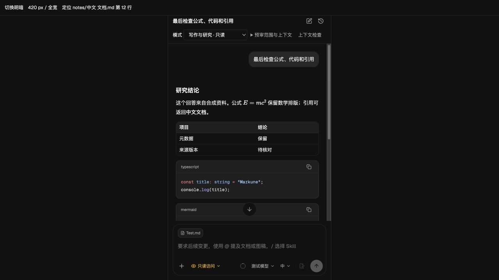
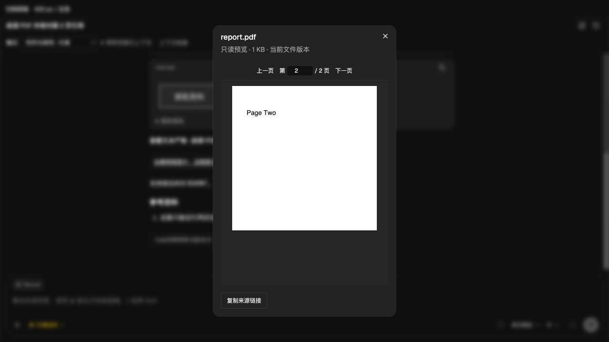
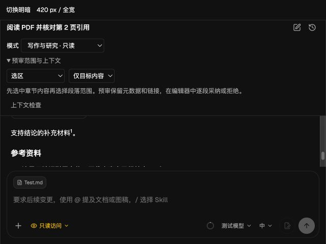

# Codex 专业化本机验收

S0–S5 的核心工程已落地，以下记录本机实际执行结果。它不是 Windows 发布验收或竞品写作质量结论。完整实现边界见 [专项架构](../../architecture/codex.md)，任务范围见 [实施清单](../../plans/codex-professionalization.md)，机器可读结果见 [checks.json](checks.json)。

2026-09-09 产品范围调整：下述早期验收中的文档预审、默认受控写作及内置写作/研究规则已按用户要求移除；相关截图仅保留作历史记录。当前文档交互为统一 Agent 问答与直接编辑，见 [当前架构](../../architecture/codex.md)。

## 主要交付

| 阶段 | 已落地内容 |
| --- | --- |
| S0 | 版本与 15 份协议契约、失败回归、活动文档与 Harness 修正 |
| S1 | 常驻连接、有界 RPC/原生 IO、代际隔离、后台任务与草稿、steer、历史分页/分支、MCP 交互、配置 overlay/CAS 与版本化凭据 |
| S2 | 权威完成稿、选区/段落/全文预审、可选上下文、文档切换保护、原生保真校验、多 hunk、写作 Skills |
| S3 | 来源定位与版本提示、PDF/文本/图片/媒体阅读、新建来源笔记、数学/高亮/Mermaid、工具图片、流合并与稳定块渲染 |
| S4 | 问题相关证据片段、版本化 EvidenceRef、主张引用约束、指令/权限/Skills/Hooks 检查器与审校流程 |
| S5 | 100 项确定性场景、100 项真实模型约束检查、升级与真实协议探针、本机完整门禁、记录与回退说明 |

## 运行时升级依据

真实模型请求明确拒绝原 0.144.4，要求更新 Codex。候选 0.153.4 的契约检查未发现已使用请求的必填字段回退；隔离升级验证保留了旧任务中文内容和旧 rollout 前缀，恢复权限、分支与冷启动均通过。随后用 Markune 客户端身份完成真实 App Server turn，收到 `final_answer` 权威完成稿，未发生工具调用。

这次升级采用官方 [0.153.4 发布版本](https://github.com/openai/codex/releases/tag/rust-v0.153.4)，源码固定为 `042fb41b7c813ac7999105e886b2b7aa715b5081`，按 [App Server 协议](https://learn.chatgpt.com/docs/app-server) 校验实际二进制。新版本的 Apps/插件 MCP 服务必须由对应 feature 开关关闭，不能在 `mcp_servers` 中伪造缺少 transport 的配置项；该真实环境问题已修复并补充回归。

## 实际检查

| 检查 | 结果 |
| --- | --- |
| 全量前端 | 128 个文件，956 项通过 |
| 全量 Rust | 314 项通过，4 项既有忽略 |
| TypeScript | 通过 |
| lint | 0 错误，4 条既有警告 |
| Web 生产构建 | 通过 |
| 桌面静态导出 | 通过；结束后 `app/api` 已恢复 |
| 协议契约 | 0.153.4 的 15 份 schema 指纹通过 |
| 隔离真实运行时 | 握手、只读、MCP 禁用、历史读取通过，无模型调用 |
| 隔离升级 | 旧内容与记录前缀保留，权限、分支、冷启动通过 |
| 真实 App Server | GPT-6 Astra 完成标记匹配，`final_answer`，工具调用 0 |
| 确定性评测 | 100 / 100 |
| 真实模型约束 | 100 / 100，GPT-6 Astra，medium；见下方边界 |
| Harness | 0 错误，0 警告 |

真实模型使用合成材料，不修改真实笔记或共享账号配置。第一轮字面检查为 90 / 100；另外 10 项把“尚未验证”表达为语义相同的“尚未经过验证”。检查任务要求保留不确定性，而非保留这四字相邻，因此在查看保留输出后修正了判定条件，并对已捕获输出重新核验，没有修改模型输出。原始摘要、复核输出指纹、调用次数和修正理由保留在 [真实模型结果](../../../evals/codex/results-2026-09-06.json)。这类约束检查不等于事实准确率、文风质量或人工盲评分数。

## UI 证据

使用真实组件和合成 Tauri 桥接进行浏览器检查；模型流在 UI 场景中为合成事件。中文路径/第 12 行回调、脚注前后跳转、深浅主题、420 px 侧栏、640×480 小窗口和真实 PDF.js 第二页定位已确认。截图只含合成内容。

## 未完成的外部验收

- Windows 实机和真实 macOS 原生应用完整交互。浏览器组件与 Rust 测试不能替代设备验收。
- 真正的桌面 200% 缩放。已做小视口检查；不把不可靠的 CDP 缩放截图当作通过证据。
- 双人盲评、Notion AI / ChatGPT 同题比较、复杂写作的事实准确率与领域质量评估。

因此本次不重新给出 9.x 分，也不宣称已超越竞品。Codex 新版本可能继续演进自己的历史格式；只验证了本次隔离升级路径，不保证降级后所有新格式任务仍可读取。普通笔记回收站和本地历史、语音与远程生态未引入。
