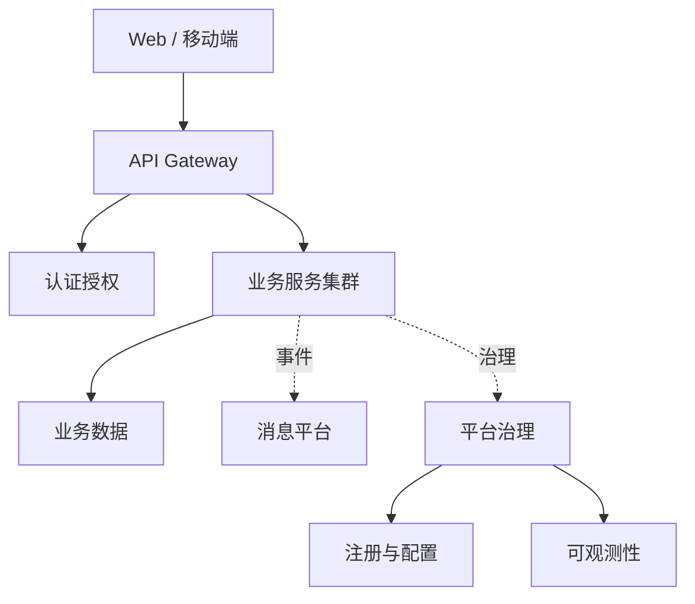

# Professional technical diagram standard

Use this reference for every flowchart and architecture diagram.

## 1. Frame the diagram

Write a private brief before Mermaid:

- audience: who will use the diagram
- question: the one question it answers
- viewpoint: context, container, request path, deployment, data, or lifecycle
- abstraction: one consistent level
- primary path: the sequence that must be obvious at a glance
- required facts: nodes and relationships that must remain
- omissions: correct details intentionally moved out of this view

If two viewpoints are equally important, create two diagrams. Do not mix runtime request flow, deployment topology, service internals, and every platform integration in one overview.

## 2. Select a profile

| Purpose | Mermaid | Profile | Direction |
| --- | --- | --- | --- |
| Layered system/software overview | `flowchart TB` | `architecture` | top to bottom |
| Small request path, pipeline, or process | `flowchart LR` | `flow` | left to right |
| Large multi-stage process | `flowchart TB` | `flow` | top to bottom |
| Sequence, class, ER, or state semantics | matching type | `default` | type-defined |

Do not use `architecture` or `flow` with non-flowchart diagram types.

## 3. Architecture budget

- Target 6–12 primary nodes and no more than 5 semantic groups.
- Target at most 14 visible relationships; 18 is the hard limit.
- Keep node fan-out at 5 or less; 6 is the hard limit.
- Use groups only for real layers, trust boundaries, deployment zones, or ownership boundaries.
- Keep the main path monotonic. Avoid backward arrows in an overview.
- Use no more than 6 dashed relationships and do not let dashed wiring dominate the picture.

The compiler rejects crossings, edges through unrelated nodes, excessive relation count, excessive fan-out, very long routed edges, overlaps, clipped labels, and literal escaped newlines.

## 4. Aggregate cross-cutting capabilities

In an architecture overview, never connect every microservice separately to registry, configuration, logs, metrics, tracing, cache, or messaging.

Use this hierarchy:

1. External actors connect to one entry point.
2. The entry point connects to authentication and one aggregate application/service node.
3. The aggregate application node connects once to data, messaging, and platform governance.
4. Platform governance connects to registry/configuration and observability details when those details are necessary.

Good pattern:

Expand individual services only when the diagram's question is specifically about their interaction. In that case, omit unrelated platform wiring and prefer a sequence diagram for runtime behavior.

## 5. Relationship semantics

- Solid arrow: primary synchronous flow or required dependency.
- Dashed arrow: asynchronous event, control plane, registration, configuration, or observation.
- Use at most two edge styles in one diagram.
- Label a relationship only when protocol, event, or intent is not obvious from its endpoints.
- Use one direction per relationship. Show bidirectionality only when it is the subject of the diagram.
- Avoid diagonal long-distance edges across groups. Move or aggregate the relationship instead.

## 6. Labels and hierarchy

- Use short ASCII IDs and quoted localized labels.
- Prefer one-line labels of 2–12 Chinese characters or similarly compact English text.
- Never write literal `\n`; shorten the label or split the concept into another node.
- Use specific domain nouns such as `订单服务`, `Redis 缓存`, or `OpenTelemetry Collector`.
- Avoid prose, decorative emoji, placeholder names, and redundant words such as `系统模块组件`.
- Put detail on a meaningful edge only when it improves interpretation.

Madora applies the professional Excalidraw theme: system sans-serif typography, straight low-roughness connectors, neutral group containers, and restrained semantic pastels. Mermaid `classDef` is optional and should not be used for layout tricks.

## 7. Repair by quality finding

Apply structural repairs before syntax or color changes:

| Finding | Required repair |
| --- | --- |
| `arrowCrossings > 0` | remove secondary cross-layer edges, aggregate shared dependencies, or split the viewpoint |
| `edgeNodeIntersections > 0` | move the relationship to adjacent layers or replace per-node wiring with one aggregate edge |
| `edgeCount > 14` | remove relationships that do not answer the diagram question; never exceed 18 |
| `maxFanOut > 5` | introduce a truthful aggregate node; never exceed 6 |
| many bends or long routed edge | eliminate remote cross-group wiring rather than forcing layout syntax |
| high backward ratio | restore one monotonic direction; move feedback/control to dashed or another diagram |
| excessive dashed edges | keep only one cross-cutting concern or replace details with a platform node |
| literal `\n`, clipping, or overflow | shorten the label; do not shrink body text below the theme minimum |
| too many nodes or groups | keep the overview and create a focused down-level diagram separately |

After repair, re-check semantic correctness. A visually clean diagram with a false relationship is still invalid.

## 8. Final review

- The title states scope and purpose.
- The main path is obvious in three seconds.
- Every node type and relationship is semantically clear.
- The diagram uses one abstraction level and one primary direction.
- No line crosses another line or unrelated node.
- Groups are meaningful, quiet, and non-overlapping.
- Labels remain readable at AI panel width.
- `quality.grade` is `A`, `quality.creatable` is `true`, and no visual defect remains.
